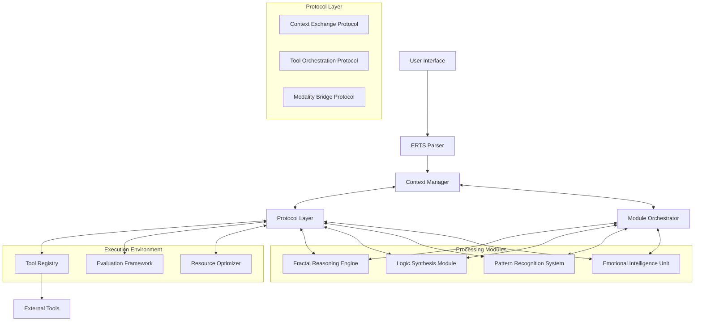

# Modular Context Protocol Architecture (MCPA)

## Context

The Modular Context Protocol Architecture (MCPA) is a next-generation framework for LLMs that builds upon Anthropic's Model Context Protocol (MCP), extending it with specialized protocols and modules for advanced reasoning. It integrates the strengths of existing frameworks (Fractal, METRICS+, ECARLM, ELSF) while introducing standardized interfaces for dynamic context management, tool orchestration, and multimodal reasoning.

## Framework Overview

### Core Concepts

MCPA extends the client-server architecture of MCP with specialized reasoning modules and protocols:

- **Protocol Layer**: Standardizes how context and capabilities are exchanged between modules
- **Processing Modules**: Specialized reasoning components that can be activated as needed
- **Integration System**: Coordinates module activation and maintains shared state
- **Execution Environment**: Manages tools, evaluation, and resources

### Architecture Diagram



## Protocol Specifications

### Context Exchange Protocol (CEP)

The CEP standardizes how context is shared between modules, ensuring consistent state representation.

```json
{
  "protocol": "CEP",
  "version": "1.0",
  "contextState": {
    "task": {
      "id": "task-123",
      "description": "Analysis of quantum computing impact on cryptocurrency",
      "components": ["technical", "security", "market"]
    },
    "reasoning": {
      "currentStage": "pattern-recognition",
      "previousStages": ["direct-analysis", "meta-analysis"],
      "insights": [
        {
          "source": "fractal-reasoning",
          "content": "Multi-scale implications from hardware to market",
          "confidence": 0.85
        },
        {
          "source": "logic-synthesis",
          "content": "Formal assessment of cryptographic vulnerabilities",
          "confidence": 0.92
        }
      ]
    },
    "resources": {
      "availableContext": 36500,
      "usedContext": 12840
    }
  },
  "actions": {
    "update": "/context/update",
    "query": "/context/query",
    "subscribe": "/context/subscribe"
  }
}
```

### Tool Orchestration Protocol (TOP)

The TOP manages how modules interact with external tools, handling tool selection, invocation, and result integration.

```json
{
  "protocol": "TOP",
  "version": "1.0",
  "tools": [
    {
      "id": "data-analyzer",
      "description": "Analyzes structured data to extract patterns and insights",
      "parameters": {
        "data": {
          "type": "json",
          "description": "The data to analyze"
        },
        "analysisType": {
          "type": "string",
          "enum": ["statistical", "temporal", "relational"],
          "description": "The type of analysis to perform"
        }
      },
      "returns": {
        "type": "json",
        "description": "Analysis results with insights and visualizations"
      }
    }
  ],
  "invocation": {
    "invoke": "/tools/invoke",
    "status": "/tools/status",
    "cancel": "/tools/cancel"
  }
}
```

### Modality Bridge Protocol (MBP)

The MBP enables seamless transitions between different data types (text, images, structured data), maintaining semantic connections.

```json
{
  "protocol": "MBP",
  "version": "1.0",
  "modalities": ["text", "image", "structured-data", "code"],
  "operations": {
    "convert": {
      "source": "text",
      "target": "structured-data",
      "parameters": {
        "structure": "table",
        "headers": true
      }
    },
    "link": {
      "entities": [
        {
          "id": "entity-1",
          "modality": "text",
          "reference": "paragraph-3"
        },
        {
          "id": "entity-2",
          "modality": "image",
          "reference": "chart-2"
        }
      ],
      "relationship": "describes"
    }
  }
}
```

## Core Components

### ERTS Parser

The ERTS Parser leverages the Enhanced Recursive Tagging System to interpret user tasks and transform them into structured instructions for the framework.

```python
class ERTSParser:
    def parse_input(self, user_input):
        """Parse user input using ERTS and generate structured task representation."""
        # Extract core categories
        subject = self.extract_category(user_input, "Subject")
        objective = self.extract_category(user_input, "Objective")
        constraints = self.extract_category(user_input, "Constraints")
        
        # Generate task structure
        task = {
            "subject": subject,
            "objective": objective,
            "constraints": constraints,
            "components": self.identify_components(subject, objective)
        }
        
        return task
    
    def identify_components(self, subject, objective):
        """Identify key components required for the task."""
        components = []
        
        # Analyze subject domains
        if self.contains_technical_elements(subject):
            components.append("technical")
        if self.contains_emotional_elements(subject):
            components.append("emotional")
            
        # Analyze objective requirements
        if "analyze" in objective.lower():
            components.append("analytical")
        if "create" in objective.lower():
            components.append("creative")
            
        return components
```

### Module Orchestrator

The Module Orchestrator determines which processing modules to engage based on task requirements.

```python
class ModuleOrchestrator:
    def __init__(self, available_modules):
        self.available_modules = available_modules
        self.active_modules = {}
        
    def orchestrate(self, task):
        """Determine which modules to activate for a given task."""
        required_capabilities = self.analyze_task_requirements(task)
        module_plan = self.create_module_plan(required_capabilities)
        
        # Activate required modules
        for module_id, config in module_plan.items():
            self.activate_module(module_id, config)
            
        return self.active_modules
        
    def analyze_task_requirements(self, task):
        """Analyze task to determine required capabilities."""
        capabilities = set()
        
        # Map components to capabilities
        component_capability_map = {
            "technical": ["logical-reasoning", "formal-analysis"],
            "emotional": ["sentiment-analysis", "empathy"],
            "analytical": ["pattern-recognition", "data-analysis"],
            "creative": ["divergent-thinking", "metaphor-generation"]
        }
        
        # Add capabilities based on task components
        for component in task.get("components", []):
            if component in component_capability_map:
                capabilities.update(component_capability_map[component])
                
        return capabilities
        
    def create_module_plan(self, required_capabilities):
        """Create a plan for module activation based on required capabilities."""
        module_plan = {}
        
        # Map capabilities to modules
        for capability in required_capabilities:
            modules = self.find_modules_with_capability(capability)
            for module in modules:
                if module.id not in module_plan:
                    module_plan[module.id] = {"capabilities": []}
                module_plan[module.id]["capabilities"].append(capability)
                
        return module_plan
        
    def activate_module(self, module_id, config):
        """Activate a module with the given configuration."""
        if module_id in self.available_modules:
            module = self.available_modules[module_id]
            module.activate(config)
            self.active_modules[module_id] = module
```

### Context Manager

The Context Manager maintains shared state across modules, ensuring consistent understanding.

```python
class ContextManager:
    def __init__(self, context_exchange_protocol):
        self.cep = context_exchange_protocol
        self.state = {
            "task": {},
            "reasoning": {
                "currentStage": "",
                "previousStages": [],
                "insights": []
            },
            "resources": {
                "availableContext": 0,
                "usedContext": 0
            }
        }
        
    def initialize_context(self, task):
        """Initialize context with task information."""
        self.state["task"] = task
        self.state["resources"]["availableContext"] = self.calculate_available_context()
        self.cep.broadcast_state_update(self.state)
        
    def update_reasoning_stage(self, new_stage):
        """Update the current reasoning stage."""
        if self.state["reasoning"]["currentStage"]:
            self.state["reasoning"]["previousStages"].append(
                self.state["reasoning"]["currentStage"]
            )
        self.state["reasoning"]["currentStage"] = new_stage
        self.cep.broadcast_state_update(self.state)
        
    def add_insight(self, source, content, confidence):
        """Add a new insight from a processing module."""
        insight = {
            "source": source,
            "content": content,
            "confidence": confidence,
            "timestamp": self.get_timestamp()
        }
        self.state["reasoning"]["insights"].append(insight)
        self.cep.broadcast_state_update(self.state)
        
    def get_current_state(self):
        """Get the current context state."""
        return self.state.copy()
```

## Processing Modules

### Fractal Reasoning Engine

The Fractal Reasoning Engine implements multi-scale analysis from your Fractal Framework.

```python
class FractalReasoningEngine:
    def __init__(self, context_exchange_protocol):
        self.cep = context_exchange_protocol
        self.context = None
        self.active = False
        
    def activate(self, config):
        """Activate the engine with the given configuration."""
        self.active = True
        self.subscribe_to_context_updates()
        
    def subscribe_to_context_updates(self):
        """Subscribe to context updates from the Context Manager."""
        self.cep.subscribe("/context/update", self.handle_context_update)
        
    def handle_context_update(self, context):
        """Handle context updates from the Context Manager."""
        self.context = context
        
    def process_macro_scale(self):
        """Process at the macro scale (cognitive architecture)."""
        if not self.active or not self.context:
            return None
            
        task = self.context["task"]
        
        analysis = {
            "scale": "macro",
            "patterns": self.identify_macro_patterns(task),
            "relationships": self.map_macro_relationships(task),
            "contradictions": self.surface_macro_contradictions(task),
            "uncertainties": self.acknowledge_macro_uncertainties(task)
        }
        
        return analysis
        
    def process_meso_scale(self, macro_analysis):
        """Process at the meso scale (component level)."""
        # Implementation based on Fractal Framework meso processing
        pass
        
    def process_micro_scale(self, meso_analysis):
        """Process at the micro scale (implementation details)."""
        # Implementation based on Fractal Framework micro processing
        pass
        
    def synthesize_insights(self, macro, meso, micro):
        """Synthesize insights across scales."""
        # Implementation based on Fractal Framework synthesis
        
        # Add insight to shared context
        self.cep.invoke("/context/update", {
            "source": "fractal-reasoning",
            "content": "Synthesized multi-scale analysis",
            "confidence": 0.87
        })
```

### Logic Synthesis Module

The Logic Synthesis Module implements formal reasoning from the ELSF framework.

```python
class LogicSynthesisModule:
    def __init__(self, context_exchange_protocol):
        self.cep = context_exchange_protocol
        self.context = None
        self.active = False
        
    def activate(self, config):
        """Activate the module with the given configuration."""
        self.active = True
        self.subscribe_to_context_updates()
        
    def subscribe_to_context_updates(self):
        """Subscribe to context updates from the Context Manager."""
        self.cep.subscribe("/context/update", self.handle_context_update)
        
    def handle_context_update(self, context):
        """Handle context updates from the Context Manager."""
        self.context = context
        
    def analyze_propositional_logic(self):
        """Analyze using propositional logic."""
        # Implementation based on ELSF formal logic layer
        pass
        
    def analyze_predicate_logic(self):
        """Analyze using predicate logic."""
        # Implementation based on ELSF formal logic layer
        pass
        
    def analyze_modal_logic(self):
        """Analyze using modal logic."""
        # Implementation based on ELSF formal logic layer
        pass
        
    def analyze_temporal_logic(self):
        """Analyze using temporal logic."""
        # Implementation based on ELSF formal logic layer
        pass
        
    def synthesize_logical_analysis(self):
        """Synthesize logical analysis results."""
        # Implementation based on ELSF synthesis process
        
        # Add insight to shared context
        self.cep.invoke("/context/update", {
            "source": "logic-synthesis",
            "content": "Formal logical analysis with temporal implications",
            "confidence": 0.92
        })
```

### Pattern Recognition System

The Pattern Recognition System implements pattern identification from the METRICS+ framework.

```python
class PatternRecognitionSystem:
    def __init__(self, context_exchange_protocol):
        self.cep = context_exchange_protocol
        self.context = None
        self.active = False
        
    def activate(self, config):
        """Activate the system with the given configuration."""
        self.active = True
        self.subscribe_to_context_updates()
        
    def analyze_patterns(self):
        """Analyze patterns using METRICS+ approach."""
        # Implementation based on METRICS+ pattern recognition
        
        # Direct analysis
        direct_patterns = self.analyze_direct_patterns()
        
        # Meta analysis
        meta_patterns = self.analyze_meta_patterns()
        
        # Cross-domain patterns
        cross_domain_patterns = self.identify_cross_domain_patterns()
        
        # Synthesize patterns
        synthesis = self.synthesize_pattern_analysis(
            direct_patterns, 
            meta_patterns,
            cross_domain_patterns
        )
        
        # Add insight to shared context
        self.cep.invoke("/context/update", {
            "source": "pattern-recognition",
            "content": synthesis["key_insight"],
            "confidence": synthesis["confidence"]
        })
```

### Emotional Intelligence Unit

The Emotional Intelligence Unit implements emotional processing from the METRICS+ framework.

```python
class EmotionalIntelligenceUnit:
    def __init__(self, context_exchange_protocol):
        self.cep = context_exchange_protocol
        self.context = None
        self.active = False
        
    def activate(self, config):
        """Activate the unit with the given configuration."""
        self.active = True
        self.subscribe_to_context_updates()
        
    def analyze_emotional_factors(self):
        """Analyze emotional factors using METRICS+ approach."""
        # Implementation based on METRICS+ emotional processing
        
        emotional_analysis = {
            "impact": self.assess_emotional_impact(),
            "psychological_factors": self.identify_psychological_factors(),
            "potential_resistance": self.assess_potential_resistance(),
            "acceptance_strategies": self.develop_acceptance_strategies()
        }
        
        # Add insight to shared context
        self.cep.invoke("/context/update", {
            "source": "emotional-intelligence",
            "content": "Emotional and psychological factor analysis",
            "confidence": 0.83
        })
```

## Tool Registry

The Tool Registry manages available tools and their capabilities.

```python
class ToolRegistry:
    def __init__(self, tool_orchestration_protocol):
        self.top = tool_orchestration_protocol
        self.tools = {}
        
    def register_tool(self, tool_definition):
        """Register a new tool with the registry."""
        tool_id = tool_definition["id"]
        self.tools[tool_id] = tool_definition
        self.top.broadcast_tool_update(tool_definition)
        
    def unregister_tool(self, tool_id):
        """Unregister a tool from the registry."""
        if tool_id in self.tools:
            del self.tools[tool_id]
            self.top.broadcast_tool_removal(tool_id)
            
    def get_tool(self, tool_id):
        """Get a tool by ID."""
        return self.tools.get(tool_id)
        
    def find_tools_by_capability(self, capability):
        """Find tools with a specific capability."""
        matching_tools = []
        for tool_id, tool in self.tools.items():
            if capability in tool.get("capabilities", []):
                matching_tools.append(tool)
        return matching_tools
        
    def invoke_tool(self, tool_id, parameters):
        """Invoke a tool with the given parameters."""
        tool = self.get_tool(tool_id)
        if not tool:
            return {"error": f"Tool '{tool_id}' not found"}
            
        return self.top.invoke_tool(tool_id, parameters)
```

## Implementation Strategy

### Phase 1: Core Infrastructure

1. Implement Protocol Layer
   - Context Exchange Protocol
   - Tool Orchestration Protocol
   - Modality Bridge Protocol

2. Build Integration System
   - ERTS Parser
   - Module Orchestrator
   - Context Manager

3. Develop Basic Processing Modules
   - Simplified Fractal Reasoning Engine
   - Simplified Logic Synthesis Module

### Phase 2: Module Implementation

1. Complete Processing Modules
   - Full Fractal Reasoning Engine
   - Full Logic Synthesis Module
   - Pattern Recognition System
   - Emotional Intelligence Unit

2. Implement Execution Environment
   - Tool Registry
   - Evaluation Framework
   - Resource Optimizer

### Phase 3: Integration and Testing

1. Integrate with Model Context Protocol
   - MCP client implementation
   - MCP server capabilities

2. Develop Testing Framework
   - Performance metrics
   - Comparative benchmarks
   - Evaluation methodology

3. Create Sample Applications
   - Research Assistant
   - Creative Collaborator
   - Technical Advisor

## Example Usage Scenarios

### Complex Research Task

```python
# Example: Analyzing quantum computing impact on cryptocurrency

# 1. Parse user input
parser = ERTSParser()
task = parser.parse_input("""
{Subject: [Quantum Computing, Cryptocurrency]}
{Objective: [Impact Analysis]}
{Constraints: [Technical Accuracy, Current Research]}
{Output: [Comprehensive Report]}

Analyze how advances in quantum computing might impact cryptocurrency security and markets over the next decade.
""")

# 2. Initialize context with task
context_manager = ContextManager(context_exchange_protocol)
context_manager.initialize_context(task)

# 3. Determine required modules
orchestrator = ModuleOrchestrator(available_modules)
active_modules = orchestrator.orchestrate(task)

# 4. Process through modules
# Modules interact through Context Exchange Protocol
fractal_engine = active_modules.get("fractal-reasoning")
if fractal_engine:
    fractal_engine.process_macro_scale()
    # Further processing through meso and micro scales

logic_module = active_modules.get("logic-synthesis")
if logic_module:
    logic_module.analyze_propositional_logic()
    # Further logical analysis

# 5. Synthesize results through Context Manager
final_context = context_manager.get_current_state()
synthesis_engine = SynthesisEngine()
response = synthesis_engine.generate_response(final_context)
```

### Multimodal Analysis with Tool Use

```python
# Example: Analyzing a dataset and creating visualizations

# 1. Parse user input
parser = ERTSParser()
task = parser.parse_input("""
{Subject: [Sales Data, Performance Trends]}
{Objective: [Analysis, Visualization]}
{Constraints: [Accuracy, Clarity]}
{Output: [Report, Charts]}

Analyze this sales dataset and create visualizations of key performance trends.
""")

# 2. Initialize context with task
context_manager = ContextManager(context_exchange_protocol)
context_manager.initialize_context(task)

# 3. Register and use tools through Tool Registry
tool_registry = ToolRegistry(tool_orchestration_protocol)
tool_registry.register_tool({
    "id": "data-analyzer",
    "description": "Analyzes structured data to extract patterns and insights",
    "capabilities": ["statistical-analysis", "trend-detection"],
    "parameters": {
        "data": {"type": "json"},
        "analysisType": {"type": "string"}
    }
})

tool_registry.register_tool({
    "id": "chart-generator",
    "description": "Generates visual charts from data",
    "capabilities": ["data-visualization"],
    "parameters": {
        "data": {"type": "json"},
        "chartType": {"type": "string"}
    }
})

# 4. Process data through tools
analysis_result = tool_registry.invoke_tool("data-analyzer", {
    "data": sales_data,
    "analysisType": "temporal"
})

chart_result = tool_registry.invoke_tool("chart-generator", {
    "data": analysis_result["trends"],
    "chartType": "line"
})

# 5. Process results through modules and synthesize response
context_manager.add_insight(
    source="data-analysis",
    content="Identified seasonal sales patterns with Q4 peaks",
    confidence=0.95
)

context_manager.add_insight(
    source="visualization",
    content="Line chart showing 3-year trend with annotations",
    confidence=0.90
)

final_context = context_manager.get_current_state()
synthesis_engine = SynthesisEngine()
response = synthesis_engine.generate_response(final_context)
```

## Evaluation Metrics

### Protocol Efficiency (PE)
Measures overhead of context exchange protocols

```python
def calculate_protocol_efficiency(execution_stats):
    """Calculate Protocol Efficiency metric."""
    useful_computation_time = execution_stats["module_processing_time"]
    protocol_overhead_time = execution_stats["protocol_processing_time"]
    total_time = useful_computation_time + protocol_overhead_time
    
    return useful_computation_time / total_time
```

### Module Coordination Index (MCI)
Evaluates how effectively modules collaborate

```python
def calculate_module_coordination_index(execution_stats):
    """Calculate Module Coordination Index."""
    successful_handoffs = execution_stats["successful_module_transitions"]
    total_handoffs = execution_stats["total_module_transitions"]
    
    return successful_handoffs / total_handoffs
```

### Context Coherence Score (CCS)
Assesses consistency of shared context across modules

```python
def calculate_context_coherence_score(context_states):
    """Calculate Context Coherence Score."""
    # Implement measurement of factual consistency and logical coherence
    # across context states from different modules
    pass
```

### Tool Integration Effectiveness (TIE)
Evaluates appropriate tool selection and usage

```python
def calculate_tool_integration_effectiveness(tool_usage_stats):
    """Calculate Tool Integration Effectiveness."""
    successful_operations = tool_usage_stats["successful_operations"]
    total_invocations = tool_usage_stats["total_invocations"]
    
    return successful_operations / total_invocations
```

## Conclusion

The MCPA framework represents a significant evolution in LLM reasoning frameworks. By building on the standardized foundation of MCP while incorporating the specialized reasoning capabilities from existing frameworks, MCPA enables more sophisticated, modular, and extensible AI reasoning systems.

This architecture addresses key limitations in current frameworks:
- Provides standardized interfaces for context exchange
- Enables seamless tool integration
- Supports multimodal reasoning
- Facilitates module coordination
- Leverages emergent capabilities of latest LLMs

The framework is designed to be flexible and extensible, allowing for continuous improvement and adaptation to new capabilities and requirements.
