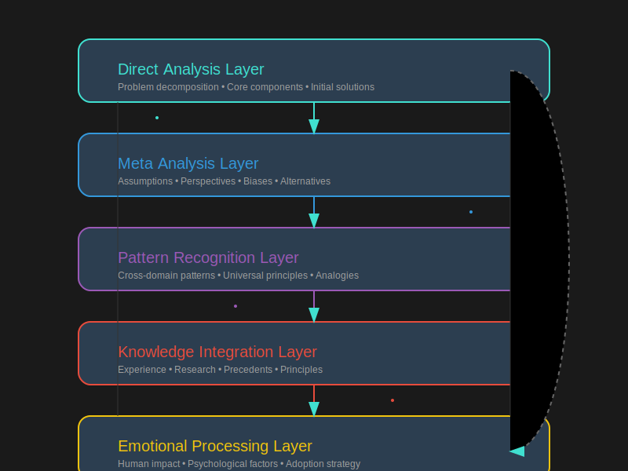

# METRICS+ Framework: A Layered Approach to Problem Solving

The METRICS+ framework provides a structured approach to problem-solving, emphasizing a layered analysis process. Each response generated using this framework must consider the following layers in order:

---

1. **Direct Analysis:** Directly addresses the problem, core components, practical considerations, and immediate solutions.

---

2. **Meta Analysis:** Examines the thinking process, assumptions, biases, and alternative perspectives.

---

3. **Pattern Recognition:** Identifies broader patterns and universal principles from other domains to gain deeper insights.

---

4. **Knowledge Integration:** Integrates relevant knowledge, research, past experiences, and established principles.

---

5. **Emotional Processing:** Considers the human and emotional elements, psychological factors, potential resistance, and strategies for acceptance.

---

Following these layers ensures a comprehensive and nuanced solution, incorporating both logical and emotional intelligence.

---

**Notice:** This framework will be moving to its own git repository as multi-agentic.

---

